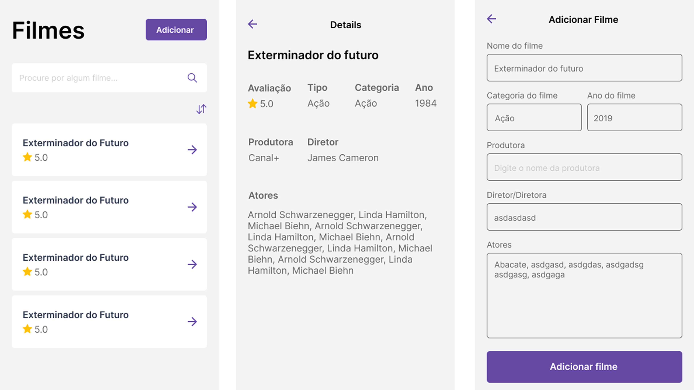
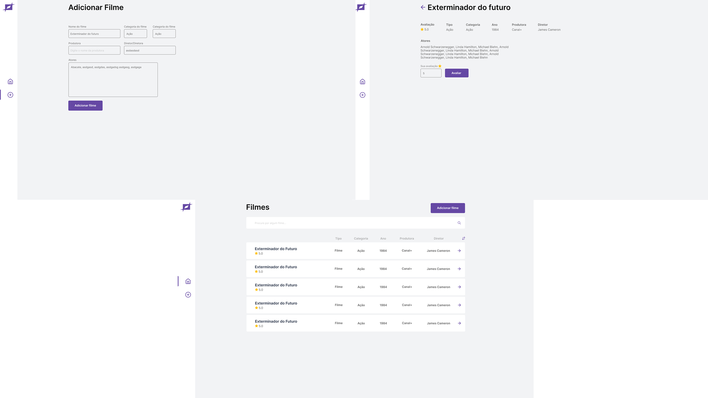

# Catálogo de filmes

Permitir cadastramento de filmes, considerando, tipo, categoria, ano, produtora, diretor, atores e deve permitir avaliação por parte de usuários. Deve exibir lista de filmes, permitindo: pesquisa e ordenação por avaliação, por nome, por diretor, por atores, ...

Muitas pessoas gostam de assistir filmes, hoje em dia tem cada vez mais se popularizado plataformas como Netflix, PrimeVideo, Disney+. Por esse motivo vamos desenvolver um site capaz de lidar com o cadastro de filmes em nosso trabalho da faculdade.

**Nome do app** permite cadastramento de filmes, que considera tipo, categoria, ano, produtora, diretor, atores e avaliação por parte dos usuários. Além disso ele exibe uma lista de filmes e permite filtro e ordenação pelos campos.

## User Stories

-   [ ] Usuário pode inserir novos filmes com os seguintes campos: tipo, categoria, ano, produtora, diretor e atores
-   [ ] Usuário pode ver uma lista de filmes
-   [ ] Usuário pode filtrar a lista de filmes por uma pesquisa
-   [ ] Usuário pode ordenar a lista de filmes pelos seguintes campos: tipo, categoria, ano, produtora e diretor
-   [ ] Usuário pode inserir uma avaliação para cada filme.

## Design do app

Aqui estão as telas que prototipamos no Figma

### Mobile

### Desktop

## Pessoas envolvidas

-   [Developer] João Dacol Soares
-   [Developer] Nicolas Grisa Prokopetz
-   [Developer] Felipe Ricardi